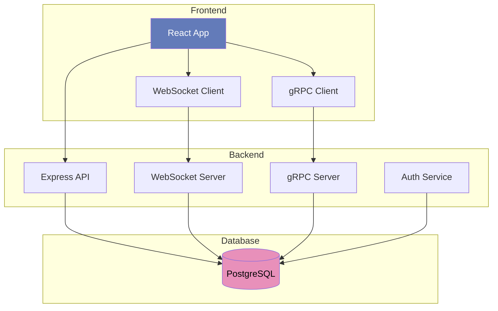
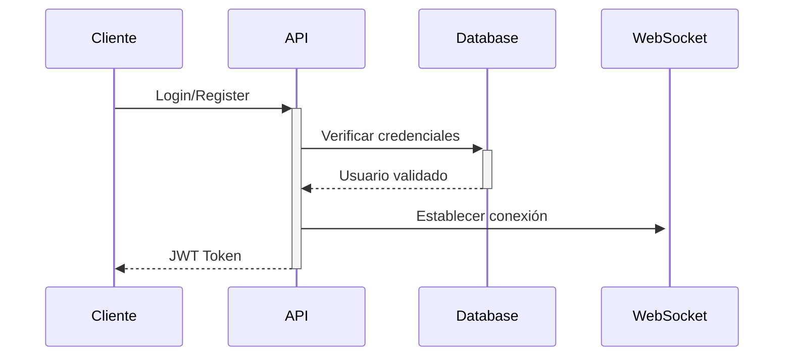
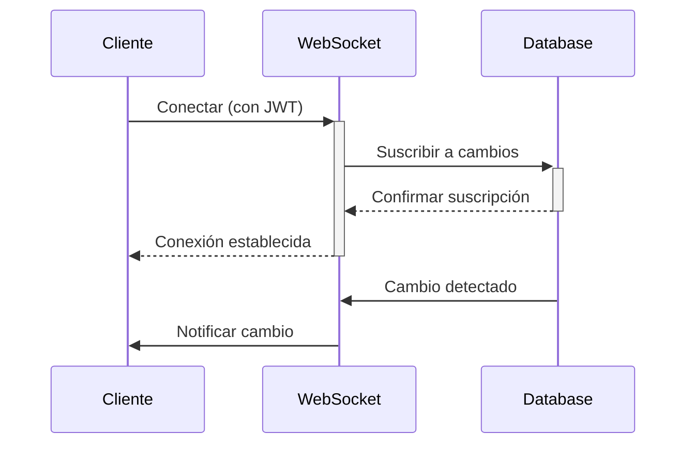
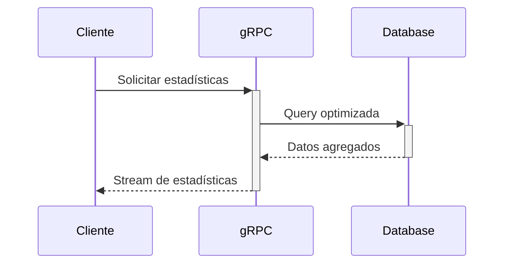

# Presentación Técnica - Sistema Maxillaris

## Arquitectura del Sistema

### Protocolos y Servicios

1. **API REST (HTTP/HTTPS)**
   - Autenticación y autorización
   - CRUD de proyectos y tareas
   - Gestión de usuarios

2. **WebSocket (WS/WSS)**
   - Actualizaciones en tiempo real
   - Notificaciones push
   - Estado de conexión de usuarios

3. **gRPC**
   - Servicio de estadísticas
   - Métricas en tiempo real
   - Comunicación eficiente entre servicios

## Decisiones Técnicas

### 1. WebSocket
- **¿Por qué?** Necesidad de actualizaciones en tiempo real
- **Beneficios:**
  - Comunicación bidireccional
  - Menor latencia que polling
  - Eficiente para múltiples clientes
- **Implementación:** Servidor WS dedicado con autenticación JWT

### 2. gRPC
- **¿Por qué?** Comunicación eficiente entre servicios
- **Beneficios:**
  - Protocol Buffers más eficientes que JSON
  - Contratos estrictos con tipos
  - Streaming bidireccional
- **Uso:** Servicio de estadísticas y métricas

### 3. React + TypeScript
- **¿Por qué?** Desarrollo frontend robusto y mantenible
- **Beneficios:**
  - Tipado estático
  - Mejor tooling y autocompletado
  - Detección temprana de errores

### 4. PostgreSQL + Drizzle
- **¿Por qué?** Base de datos relacional con ORM moderno
- **Beneficios:**
  - Integridad referencial
  - Migraciones tipo-seguras
  - Queries optimizadas

## Flujo de Trabajo

### 1. Autenticación

### 2. Actualización en Tiempo Real

### 3. Estadísticas

## Producción

### 1. Preparación
- Optimización de builds
- Configuración de variables de entorno
- Pruebas de integración

### 2. Despliegue
- Construcción de imágenes Docker
- Configuración de red y volúmenes
- Verificación de servicios

### 3. Monitoreo
- Logs centralizados
- Métricas de rendimiento
- Alertas automáticas

## Posibles Mejoras

### 1. Escalabilidad
- Load balancing para WebSocket
- Sharding de base de datos
- Cache distribuido

### 2. Seguridad
- WAF (Web Application Firewall)
- Rate limiting por IP
- Auditoría detallada
- Backup automatizado

### 3. Optimizaciones
- CDN para assets estáticos
- Compresión de respuestas
- Lazy loading de módulos
- Service Workers para offline

### 4. Funcionalidades
- Sistema de notificaciones push
- Integración con servicios externos
- API pública documentada
- Soporte multi-idioma

### 5. DevOps
- Pipeline CI/CD
- Tests automatizados
- Despliegue blue-green
- Monitoreo proactivo
