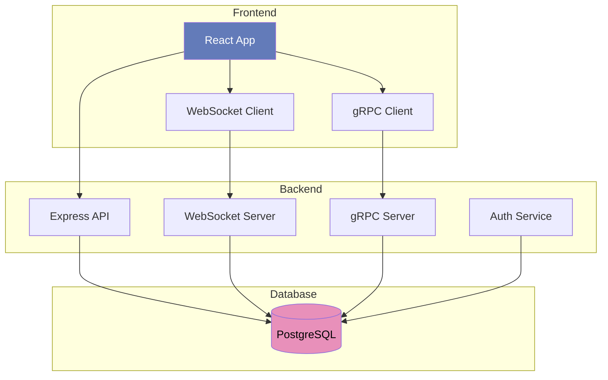
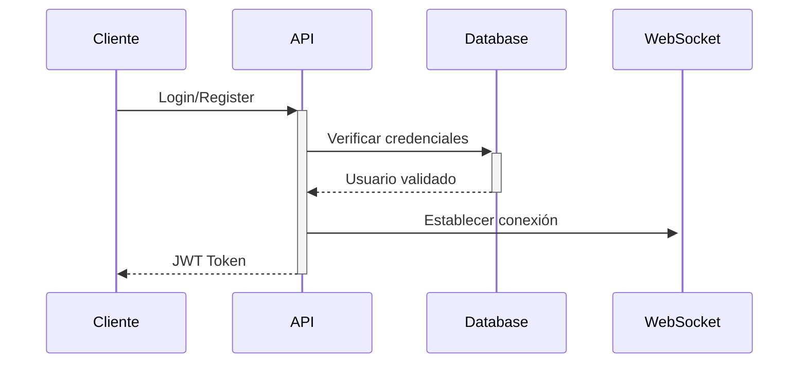
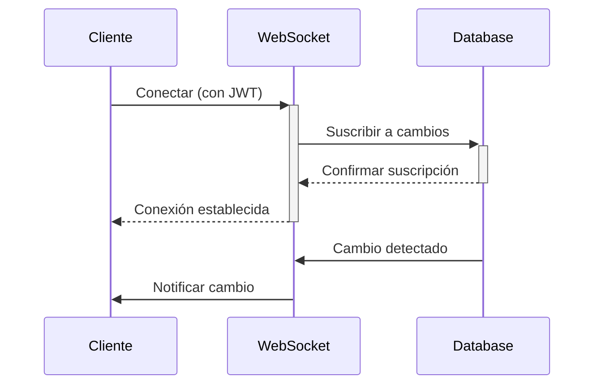
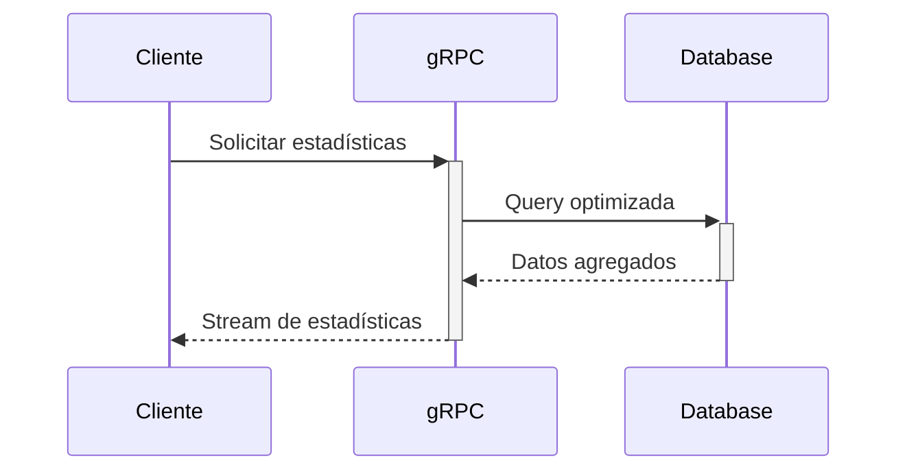

# Presentación Técnica - Sistema Maxillaris

## Arquitectura del Sistema



### Protocolos y Servicios

1. **API REST (HTTP/HTTPS)**
   - Autenticación y autorización
   - CRUD de proyectos y tareas
   - Gestión de usuarios

2. **WebSocket (WS/WSS)**
   - Actualizaciones en tiempo real
   - Notificaciones push
   - Estado de conexión de usuarios

3. **gRPC**
   - Servicio de estadísticas
   - Métricas en tiempo real
   - Comunicación eficiente entre servicios

## Despliegue en Google Cloud

### 1. Preparación del Entorno
```bash
# Iniciar sesión y configurar proyecto
gcloud auth login
gcloud config set project [PROJECT_ID]

# Habilitar APIs necesarias
gcloud services enable \
  cloudbuild.googleapis.com \
  run.googleapis.com \
  cloudscheduler.googleapis.com \
  secretmanager.googleapis.com \
  sqladmin.googleapis.com
```

### 2. Configuración de Base de Datos
```bash
# Crear instancia PostgreSQL
gcloud sql instances create maxillaris-db \
  --database-version=POSTGRES_15 \
  --tier=db-f1-micro \
  --region=us-central1

# Crear base de datos
gcloud sql databases create maxillaris \
  --instance=maxillaris-db

# Configurar usuario y contraseña
gcloud sql users set-password postgres \
  --instance=maxillaris-db \
  --password=[PASSWORD]
```

### 3. Configuración de Secretos y Variables
```bash
# Crear secretos
echo -n "[DATABASE_URL]" | \
  gcloud secrets create DATABASE_URL --data-file=-

echo -n "[JWT_SECRET]" | \
  gcloud secrets create JWT_SECRET --data-file=-

# Asignar permisos
gcloud secrets add-iam-policy-binding DATABASE_URL \
  --member=serviceAccount:${PROJECT_NUMBER}-compute@developer.gserviceaccount.com \
  --role=roles/secretmanager.secretAccessor
```

### 4. Despliegue de la Aplicación
```bash
# Construir imagen
gcloud builds submit --tag gcr.io/[PROJECT_ID]/maxillaris

# Desplegar en Cloud Run
gcloud run deploy maxillaris \
  --image gcr.io/[PROJECT_ID]/maxillaris \
  --platform managed \
  --region us-central1 \
  --allow-unauthenticated \
  --set-secrets DATABASE_URL=DATABASE_URL:latest \
  --set-secrets JWT_SECRET=JWT_SECRET:latest \
  --set-env-vars "NODE_ENV=production"
```

### 5. Configuración de Red y Seguridad
```bash
# Configurar políticas de red
gcloud run services update maxillaris \
  --ingress=internal-and-cloud-load-balancing

# Configurar SSL/TLS
gcloud run domain-mappings create \
  --service maxillaris \
  --domain [YOUR_DOMAIN] \
  --region us-central1
```

### 6. Monitoreo y Mantenimiento
- Logs centralizados con Cloud Logging
- Métricas de rendimiento en Cloud Monitoring
- Alertas automáticas configuradas

## Decisiones Técnicas

### Frontend
- React + TypeScript para desarrollo robusto
- TanStack Query para gestión de estado
- WebSocket para actualizaciones en tiempo real

### Backend
- Express.js para API REST
- gRPC para servicios internos
- PostgreSQL con Drizzle ORM

### Infraestructura
- Cloud Run para escalabilidad
- Cloud SQL para base de datos
- Secret Manager para credenciales


## Flujo de Trabajo

### 1. Autenticación


### 2. Gestión de Proyectos y Tareas en Tiempo Real


### 3. Estadísticas y Métricas


## Mejoras Futuras

### Escalabilidad
- Load balancing para WebSocket
- Sharding de base de datos
- Cache distribuido

### Seguridad
- WAF implementación
- Rate limiting
- Auditoría detallada
- Backup automatizado

### DevOps
- Pipeline CI/CD
- Tests automatizados
- Despliegue blue-green
- Monitoreo proactivo