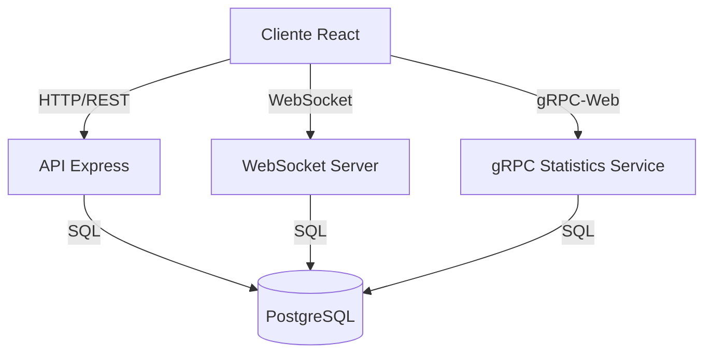
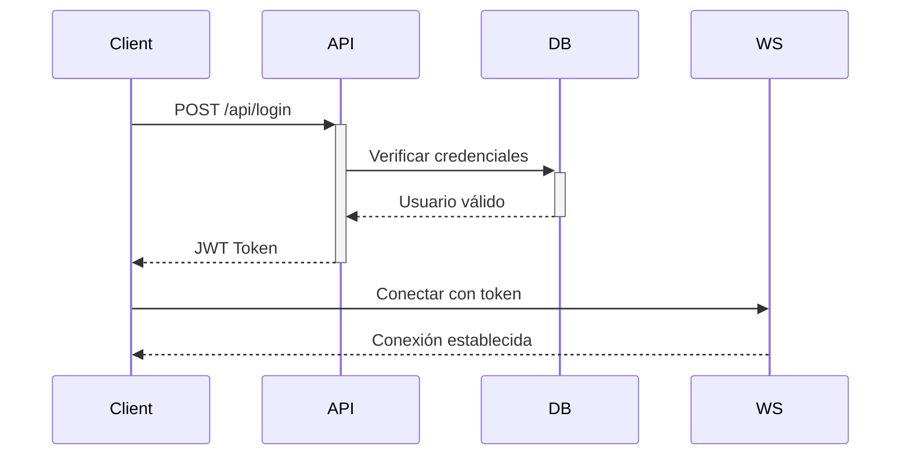
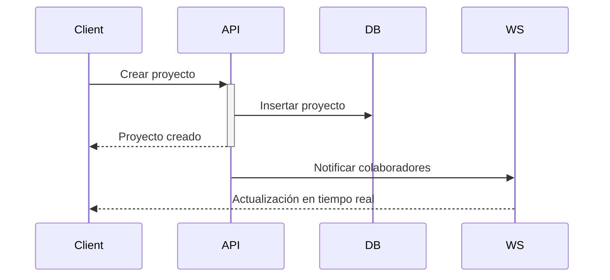
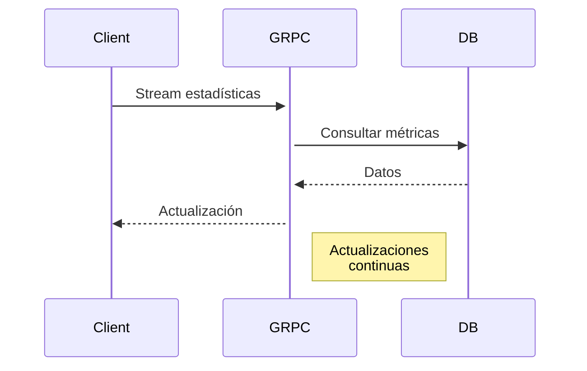

# Presentación Técnica - Maxillaris

## Arquitectura del Sistema



### Componentes Principales

1. **Frontend (React + TypeScript)**
   - Interfaz de usuario moderna y responsive
   - Estado global con TanStack Query
   - Tema personalizado con Tailwind CSS
   - Conexiones en tiempo real vía WebSocket

2. **API REST (Express)**
   - Autenticación y autorización
   - CRUD de proyectos y tareas
   - Gestión de colaboradores

3. **WebSocket Server**
   - Notificaciones en tiempo real
   - Actualizaciones de estado
   - Colaboración en tiempo real

4. **Servicio gRPC**
   - Cálculo de estadísticas
   - Métricas en tiempo real
   - Alta performance

5. **Base de Datos (PostgreSQL)**
   - Persistencia de datos
   - Relaciones y constraints
   - Índices optimizados

## Decisiones Técnicas

### 1. WebSocket
- **¿Por qué?**
  - Comunicación bidireccional en tiempo real
  - Menor overhead que polling
  - Ideal para notificaciones y actualizaciones
- **Alternativas consideradas**
  - Server-Sent Events (no bidireccional)
  - Long polling (mayor latencia)

### 2. gRPC
- **¿Por qué?**
  - Protocol Buffers más eficientes que JSON
  - Contratos estrictos y type-safe
  - Streaming bidireccional
- **Alternativas consideradas**
  - REST (mayor overhead)
  - GraphQL (más complejo para este caso)

### 3. Arquitectura de Microservicios
- **¿Por qué?**
  - Mejor escalabilidad
  - Despliegue independiente
  - Aislamiento de funcionalidades
- **Beneficios**
  - Mantenimiento más sencillo
  - Mejor tolerancia a fallos
  - Escalado selectivo

## Flujo de Trabajo

### 1. Autenticación


### 2. Gestión de Proyectos


### 3. Estadísticas en Tiempo Real


## Producción

### Pasos de Despliegue

1. **Preparación**
   ```bash
   npm run build
   docker build -t maxillaris-app .
   ```

2. **Base de Datos**
   ```bash
   npm run db:push
   ```

3. **Servicios**
   ```bash
   docker-compose up -d
   ```

4. **Monitoreo**
   - Logs centralizados
   - Métricas de rendimiento
   - Alertas automáticas

## Posibles Mejoras

### 1. Escalabilidad
- Containerización con Kubernetes
- Caché distribuida con Redis
- Balanceo de carga

### 2. Seguridad
- Autenticación de dos factores
- Cifrado de datos sensibles
- Rate limiting y WAF

### 3. Rendimiento
- CDN para assets estáticos
- Optimización de queries
- Caché de consultas frecuentes

### 4. Funcionalidad
- Sistema de plugins
- API pública
- Integración con servicios externos

### 5. DevOps
- Pipeline CI/CD robusto
- Tests automatizados
- Backups y disaster recovery

## Conclusiones

El sistema Maxillaris demuestra una arquitectura moderna y escalable, utilizando las mejores prácticas y tecnologías actuales. La combinación de WebSocket, gRPC y una arquitectura de microservicios proporciona una base sólida para futuras expansiones y mejoras.
